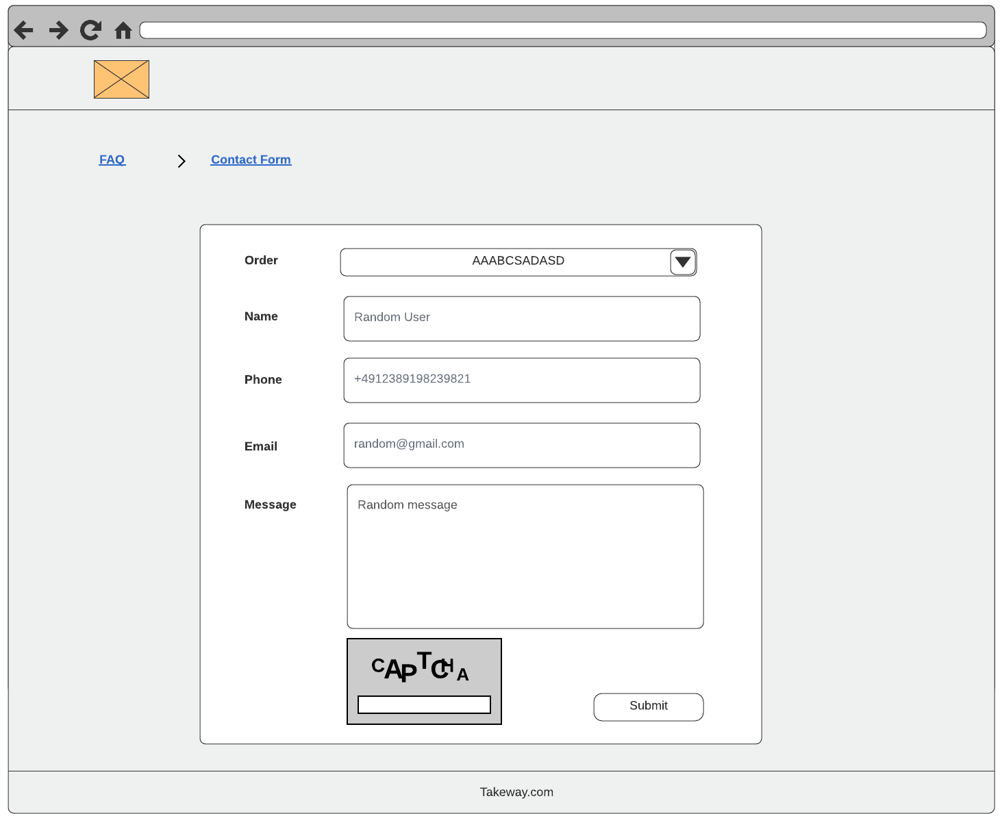
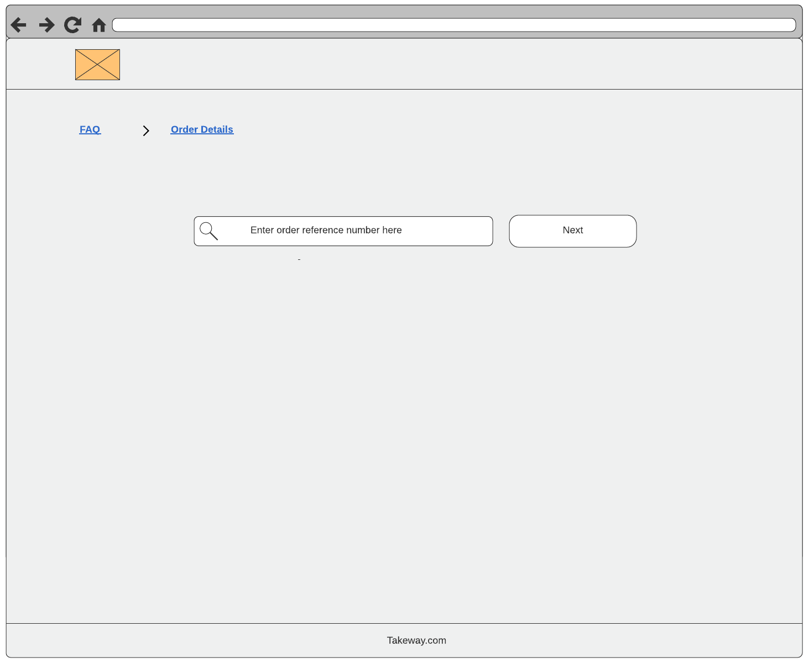
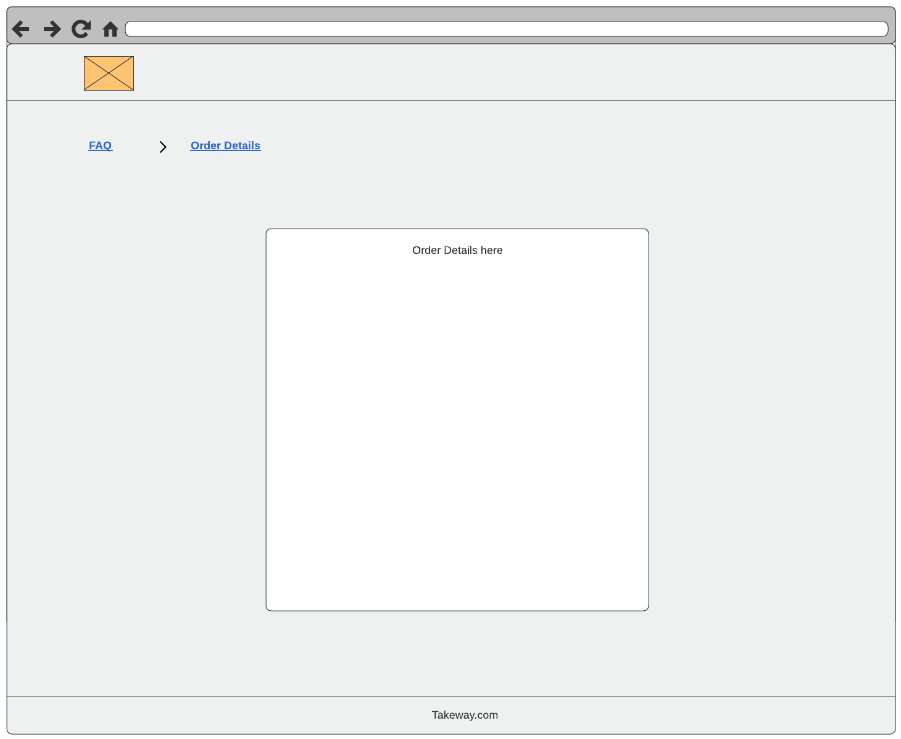
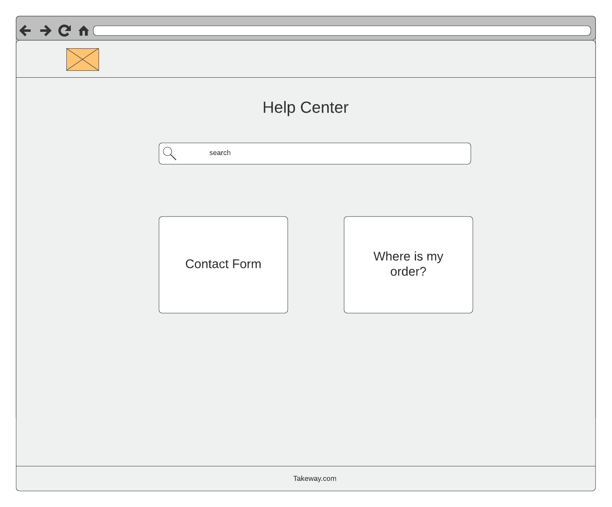

# FAQ App Challenge

This repository contains the FAQ App challenge used for on-boarding new candidates
to the BOHC (Back office Help Center) team.

## Getting Started

For this challenge, we have provided you with a Makefile, making it easy to
build and run the challenge, along with running the tests.

### Prerequisites

You need to have docker pre-installed.

### Installing

You will need to run

```sh
make build
```
OR (for non-unix users)
```sh
docker-compose down
docker-compose build
docker run -w=/app -v=$(PWD)/backend/:/app node:lts-alpine npm install
docker run -w=/app -v=$(PWD)/frontend/:/app node:lts-alpine npm install
```

at the root folder of the challenge to ensure the challenge is fully built before running it.

### Running the tests

All tests, frontend and backend, need to be able to run by issuing the following command

```sh
make test
```
OR (for non-unix users)
```sh 
docker run -w=/app -v=$(PWD)/backend/:/app node:lts-alpine npm run test
docker run -w=/app -v=$(PWD)/frontend/:/app node:lts-alpine npm run test
```


### Run the Challenge

The whole challenge should be runnable by issuing the following command from the root
of the repository

```sh
make run
```
OR (for non-unix users)
```sh 
docker-compose up -d
```

and then viewable by visiting [localhost:12000](http://localhost:12000/).

## The Challenge Itself

What do you actually have to do?

### Frontend
We have provided a skeleton of a Next.js project for the frontend component of this challenge
along with wire frames (see below). It is up to you to decide how pretty you wish the layout
to be. For simplicity's sake, we have included react-bootstrap into the skeleton for you to
use, should you wish. We expect the frontend to be responsive and support **both** *desktop* and 
*mobile* views.

We expect the following to be built:
  
* A **Contact Form** *page* consisting of the basic form shown in the wireframe. If you wish,
you may include some kind of feedback to the user upon submitting the contact form.

* An **Order Details** *page* which first shows a simple search bar, allowing one to search 
using an **Order Reference** (see the **reference** field from _./backend/src/config/orders.mjs_)
and then, on the same page, renders the associated details below when the *Next/Submit* button
is clicked. One should be able to type in another **Order Reference** and re-click the
*Next/Submit* button to change the details shown without needing to refresh the page. If the 
searched for **Order Reference** is non-existent, it should show something to the user
to make this obvious. The order search and details should come from the **orders** endpoint
found in the backend.

* A **Main** *page* which consists of cards (as shown in the wireframe), each leading
to the respective pages mentioned above. _Note_: _You are not expected to implement the
functionality of the search bar shown in the wireframe. You only need to create its look
and responsiveness._ 

* Upon opening each page, an API call should be made to the **page view** endpoint, including 
when the page is refreshed. The following data needs to be sent to the endpoint:
  * The *path* of the current page

### Tests
We expect a reasonable amount of code coverage along with explanations as to why you included the
tests you did.

### What we are paying attention to
* Code implementation correctness i.e. does everything work correctly and how it is supposed, does the project run properly
* Code structure and naming i.e. how the code is structured/modularised and how easy it is to read and follow the code
* Appropriate unit tests
* Responsiveness of the application

### Wireframes

#### Contact Form Page


#### Order Details Page


#### Order Details Page Continued


#### Main Page


## Submitting the Challenge
We expect you to upload the challenge to a git repository of your choosing and share
it with us (see authors below), such that we can view the solution. We will be paying
attention to your git commit messages etc. and would like all commit history to be present,
hence, we ask that you do not squash the commits.

## Built With

* [Docker](https://www.docker.com/) - Containerising applications
* [NPM](https://www.npmjs.com/) - Dependency Management
* [Nodejs](https://nodejs.org/) - Lightweight javascript runtime
* [React](https://reactjs.org/) - Frontend reactive framework
* [Next.js](https://nextjs.org/) - React framework

## Authors

* [Anirvan Bhaduri](mailto:anirvan.bhaduri@justeattakeaway.com)
* [Erkand Imeri](mailto:erkand.imeri@justeattakeaway.com)
* [Yashar Ayari](mailto:yashar.ayari@justeattakeaway.com)
* [Milos Jovanovic](mailto:milos.jovanovic@justeattakeaway.com)
